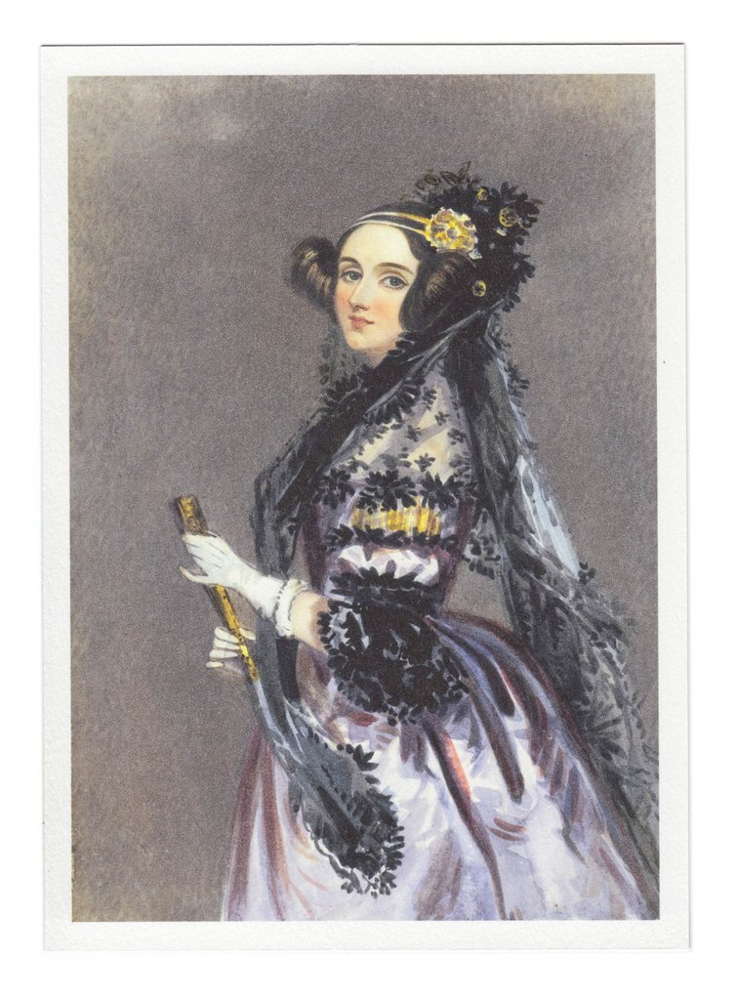

# README.md
# Edit this file for a1:Basic Tools I: Part II
# Ada Lovelace
`ALT`

- Birth: Dec. 10,1815
- Death: Nov. 27,1852
- Age at death: 37

Main area of research:
- Bernoulli number
- parallelogram

Key facts about personal live:

- she is the _daughter of Lord Byron_, the Romantic poet.
- Her work inspired the **Defense Department** to name a programming language after her.

Key professional contributions:
- Wrote book _Translation of an Academic Paper_.
- Her idea of the abstract **principles of computation**.

Key quotation from the obituary:
```
“With an understanding thoroughly masculine
in solidity, grasp and firmness, Lady Lovelace
had all the delicacies of the most refined
female character," obituary in The London Examiner.
```
Reflective Paragraph:

Who does she think is the most important person in her live to support her in her career and education. Also, who helped her the most to find herself useful in the field of computer science? I would like to ask this two question because I think a person's success must correlates with people surrounded them. :rocket:

[Link to the obituary]
https://www.nytimes.com/interactive/2018/obituaries/overlooked-ada-lovelace.html

[link to Wikipedia entry]
https://en.wikipedia.org/wiki/Ada_Lovelace


# Karen Sparck Jones
`ALT`

- Birth: Aug. 26, 1935
- Death: Apr. 4, 2007
- Age of death: 72

Main area of research:
- Basis of seach engines
- Statistics and linguistics

Key facts about personal live:

- She is a **self-taught programmer** with a focus on natural language processing.
- She and her husband Needham **chose not to have children**.

Key professional contributions:
- work on the _Alvey Program_
- published _Synonymy and Semantic Classification_

Key quotation from the obituary:
```
"A lot of the stuff she was working on
until five or 10 years ago seemed like
mad nonsense, and now we take it
for granted," said John Tait,
a longtime friend who works with the
British Computer Society.
```
Reflective Paragraph:

What did she experienced to make her think about studying on search engine? Why did she think search engine is important back then? Live in nowadays world, search engine is necessary,because we have so many informations online, but how come did she think about it? :smile:

[Link to the obituary]
https://www.nytimes.com/2019/01/02/obituaries/karen-sparck-jones-overlooked.html

[link to Wikipedia entry]
https://en.wikipedia.org/wiki/Karen_Sp%C3%A4rck_Jones
